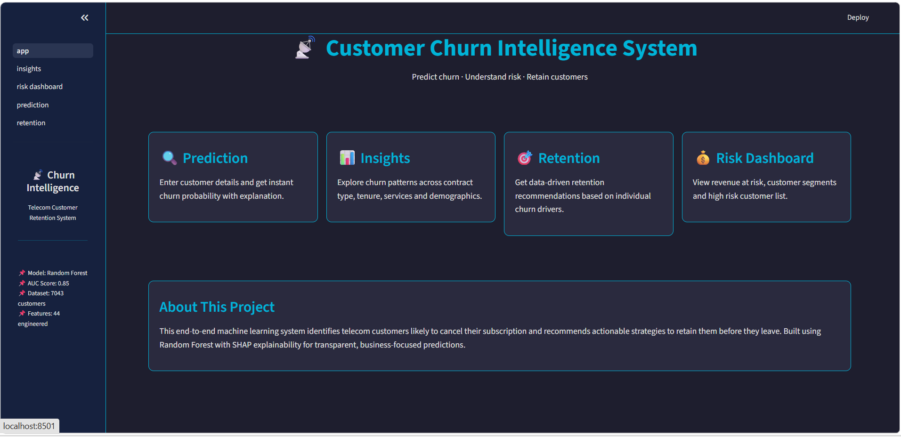
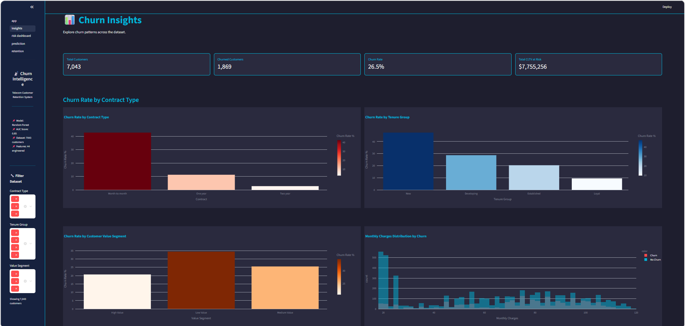
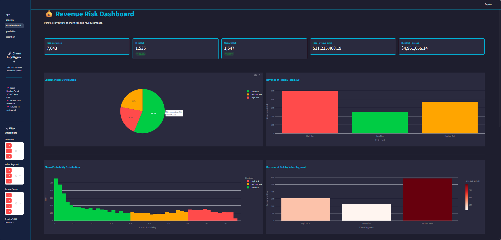
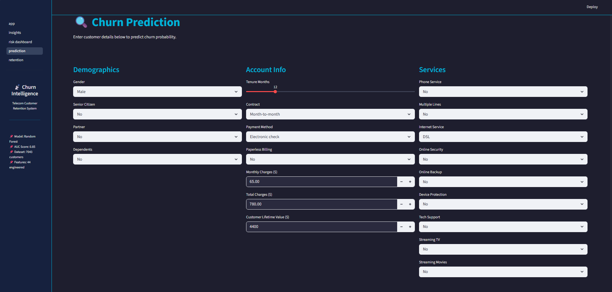
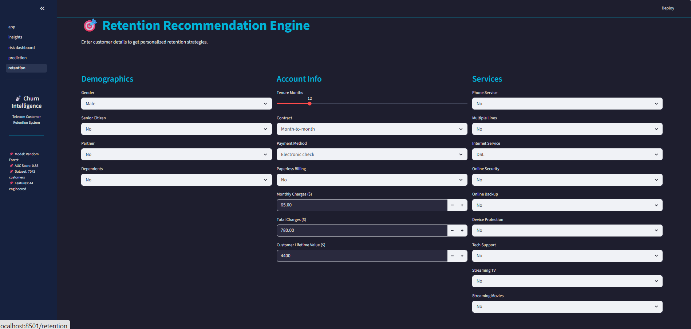

# 📡 Customer Churn Intelligence System

An end-to-end machine learning system that predicts telecom customer churn 
and recommends personalized retention strategies to reduce revenue loss.

---

## 🖥️ Live Demo
[Click here to view the live app](#) <!-- add deployment link after hosting -->

---

## 📸 Screenshots

### Home


### Churn Insights


### Risk Dashboard


### Churn Prediction


### Retention Engine


---

## 🎯 Problem Statement
Telecom companies lose significant revenue every year due to customer churn.
This system identifies customers likely to cancel their subscription and 
recommends actionable strategies to retain them before they leave.

---

## 🏗️ Project Structure
```
Churn-Intelligence/
├── data/
│   ├── raw/                  # Original dataset
│   └── processed/            # Cleaned and engineered data
├── notebooks/
│   ├── 01_EDA.ipynb          # Exploratory data analysis
│   ├── 02_data_cleaning.ipynb
│   ├── 03_feature_engineering.ipynb
│   ├── 04_model_training.ipynb
│   └── 05_shap_explainability.ipynb
├── src/
│   ├── preprocessing/        # Data preprocessing pipeline
│   ├── models/               # Saved models and artifacts
│   ├── explainability/       # SHAP helper functions
│   ├── retention/            # Retention recommendation engine
│   └── utils/                # Helper functions
├── app/
│   ├── app.py                # Main entry point
│   ├── styles.py             # Shared UI styles
│   └── pages/
│       ├── 01_insights.py
│       ├── 02_risk_dashboard.py
│       ├── 03_prediction.py
│       └── 04_retention.py
├── reports/
│   ├── screenshots/          # App screenshots
│   └── *.png                 # EDA and model charts
├── requirements.txt
└── README.md
```

---

## 🔬 Machine Learning Pipeline

### Dataset
- **Source:** IBM Telco Customer Churn Dataset
- **Size:** 7,043 customers, 33 features
- **Target:** Churn Value (0 = Stay, 1 = Churn)

### Feature Engineering
- Tenure Group (New, Developing, Established, Loyal)
- Average Monthly Spend
- Charge to CLTV Ratio
- Total Services subscribed
- 6 Risk Indicator flags
- Customer Value Segment (Low, Medium, High)

### Models Trained
| Model | ROC-AUC | Precision | Recall | F1 Score |
|-------|---------|-----------|--------|----------|
| Logistic Regression | 0.8528 | 0.5211 | 0.7914 | 0.6285 |
| Random Forest Tuned | **0.8518** | **0.5591** | 0.7594 | **0.6440** |
| XGBoost Tuned | 0.8513 | 0.5111 | 0.7968 | 0.6228 |

### Final Model
**Random Forest** selected for best F1 Score (0.6440) and Precision (0.5591).
All models were tuned using GridSearchCV with 5-fold cross validation.

---

## 💡 Key Findings

- Month-to-month customers churn at **42.7%** vs 2.8% for two-year contracts
- Electronic check payment method has highest churn rate at **45.3%**
- New customers (0-12 months tenure) churn at **47.4%**
- Senior citizens churn at **41.7%** — nearly double the average
- Top churn reason: **Attitude of support person** (~190 customers)
- 3 out of top 5 churn reasons are **competitor-related**

---

## 🎯 Retention Engine

Rule-based recommendation system that maps churn drivers to business actions:

| Churn Driver | Recommended Action | Expected Impact |
|-------------|-------------------|-----------------|
| Month-to-month contract | Offer 20% discount on annual plan | ~35% churn reduction |
| New customer | Personalized onboarding campaign | ~25% early retention |
| Fiber optic + high charges | Loyalty discount or speed upgrade | ~20% price churn reduction |
| Electronic check payment | Auto payment switch incentive | ~15% friction reduction |
| No tech support | Free 2-month tech support trial | ~18% stickiness increase |

---

## 🚀 How to Run Locally

```bash
# clone the repository
git clone https://github.com/imakash45/Churn-Intelligence.git
cd Churn-Intelligence

# create virtual environment
python -m venv churn
churn\Scripts\activate

# install dependencies
pip install -r requirements.txt

# run the app
streamlit run app/app.py
```

---

## 🛠️ Tech Stack

- **Python 3.x**
- **Machine Learning:** scikit-learn, XGBoost
- **Explainability:** SHAP
- **Dashboard:** Streamlit, Plotly
- **Data Processing:** Pandas, NumPy
- **Visualization:** Matplotlib, Seaborn, Plotly

---

## 👨‍💻 Author
Akash Kumar  
[LinkedIn](https://www.linkedin.com/in/imakash45/) | [GitHub](https://github.com/imakash45)
